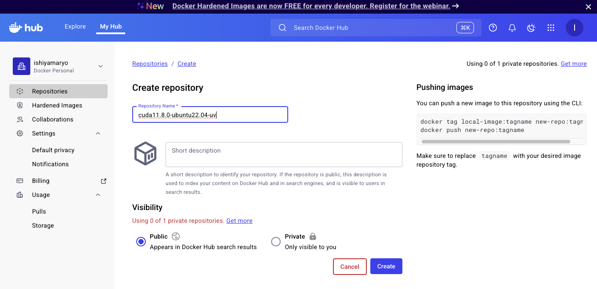

## Docker Hubでのリポジトリ作成
1. Docker Hubにログイン

2. 新規リポジトリ作成

例として，環境の詳細がわかるように，`cuda11.8.0-ubuntu22.04-uv`とした．

以下のように作成される；
https://hub.docker.com/repository/docker/ishiyamaryo/cuda11.8.0-ubuntu22.04-uv/general
